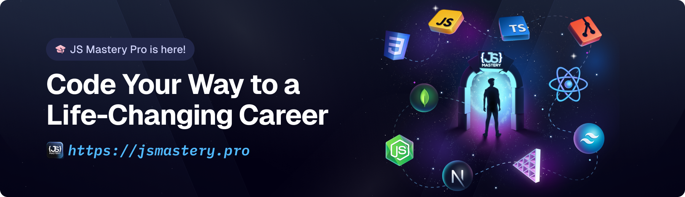

<div align="center">
  <br />
    <a href="https://www.youtube.com/watch?v=E-fdPfRxkzQ" target="_blank">
      
    </a>
  <br />

  <div>
    
    
    
    
    
  </div>

  <h3 align="center">Interactive 3D Portfolio Website</h3>

   <div align="center">
     Build this project step by step with our detailed tutorial on <a href="https://www.youtube.com/@javascriptmastery/videos" target="_blank"><b>JavaScript Mastery</b></a> YouTube. Join the JSM family!
    </div>
</div>

## 📋 Table of Contents

1. [Introduction](#introduction)
2. [Tech Stack](#tech-stack)
3. [Features](#features)
4. [Project Structure](#project-structure)
5. [Quick Start](#quick-start)
6. [Environment Variables](#environment-variables)
7. [Available Scripts](#available-scripts)
8. [Assets & Resources](#assets--resources)
9. [Deployment](#deployment)
10. [Contributing](#contributing)

## 🤖 Introduction

The 3D Portfolio project is a highly engaging personal website that features animated 3D scenes, smooth camera transitions, interactive model showcases, and responsive design. It's ideal for developers, designers, or freelancers looking to stand out in the digital crowd.

This project demonstrates modern web development practices with React, Three.js, and advanced animation techniques.

If you're getting started and need assistance or face any bugs, join our active Discord community with over **50k+** members. It's a place where people help each other out.

<a href="https://discord.com/invite/n6EdbFJ" target="_blank"></a>

## ⚙️ Tech Stack

### Core Technologies

- **React 19.2.0** - Modern UI library (latest stable)
- **Vite 7.1.12** - Fast build tool and development server (latest)
- **Three.js 0.180.0** - 3D graphics library (latest)
- **React Three Fiber 9.4.0** - React renderer for Three.js (latest)
- **Drei 10.7.6** - Useful helpers for React Three Fiber (latest)
- **GSAP 3.13.0** - Professional animation library (latest)
- **Tailwind CSS v4.1.16** - Utility-first CSS framework (latest)
- **EmailJS 4.4.1** - Email service integration

### Additional Libraries

- **react-responsive 10.0.1** - Media query hooks for responsive design
- **@react-three/postprocessing 3.0.4** - Post-processing effects for 3D scenes

## 🔋 Features

### ✨ Key Features

- **Animated 3D Models** - Interactive 3D scenes with React Three Fiber
- **Smooth Animations** - GSAP-powered scroll interactions and transitions
- **Realistic Lighting** - Advanced lighting and shadows in 3D scenes
- **Responsive Design** - Mobile-first approach with Tailwind CSS
- **Micro Interactions** - Engaging UI feedback and animations
- **Multi-Section Layout** - Hero, Work, Experience, Skills, Testimonials, Contact
- **Mobile Optimized** - Optimized 3D experience across all devices
- **Email Integration** - Contact form powered by EmailJS
- **Performance Optimized** - Optimized 3D models and asset loading

### 📱 Sections

1. **Hero Section** - Animated introduction with 3D room model
2. **Showcase Section** - Project showcases and highlights
3. **Logo Showcase** - Client/company logo carousel
4. **Feature Cards** - Key abilities and strengths
5. **Experience** - Work experience timeline with details
6. **Tech Stack** - Interactive 3D technology icons
7. **Testimonials** - Client/colleague testimonials
8. **Contact** - Contact form with 3D computer model
9. **Footer** - Social links and additional information

## 📁 Project Structure

```
personal_portfolio/
├── public/
│   ├── images/          # Static images and assets
│   │   ├── logos/       # Company/tech logos
│   │   └── textures/    # 3D model textures
│   └── models/          # 3D model files (.glb)
│
├── src/
│   ├── components/      # Reusable UI components
│   │   ├── models/      # 3D model components (React Three Fiber)
│   │   │   ├── contact/ # Contact section 3D models
│   │   │   ├── hero_models/ # Hero section 3D models
│   │   │   └── tech_logos/  # Tech stack 3D icons
│   │   ├── AnimatedCounter.jsx
│   │   ├── Button.jsx
│   │   ├── ExpContent.jsx
│   │   ├── GlowCard.jsx
│   │   ├── NavBar.jsx
│   │   └── TitleHeader.jsx
│   │
│   ├── sections/        # Page sections
│   │   ├── Contact.jsx
│   │   ├── Experience.jsx
│   │   ├── FeatureCards.jsx
│   │   ├── Footer.jsx
│   │   ├── Hero.jsx
│   │   ├── LogoShowcase.jsx
│   │   ├── ShowcaseSection.jsx
│   │   ├── TechStack.jsx
│   │   └── Testimonials.jsx
│   │
│   ├── constants/       # Shared constants and data
│   │   └── index.js     # Navigation links, testimonials, etc.
│   │
│   ├── App.jsx          # Main app component
│   ├── main.jsx         # Application entry point
│   └── index.css        # Global styles
│
├── .cursorrules         # Cursor AI configuration
├── .env                 # Environment variables (not committed)
├── eslint.config.js     # ESLint configuration
├── netlify.toml         # Netlify deployment config
├── package.json         # Dependencies and scripts
├── vite.config.js       # Vite configuration
└── README.md            # Project documentation
```

## 🤸 Quick Start

### Prerequisites

Make sure you have the following installed on your machine:

- [Node.js](https://nodejs.org/en) (v18 or higher recommended)
- [npm](https://www.npmjs.com/) or [yarn](https://yarnpkg.com/)
- [Git](https://git-scm.com/)

### Installation

1. **Clone the repository**

   ```bash
   git clone <your-repo-url>
   cd personal_portfolio
   ```

2. **Install dependencies**

   ```bash
   npm install
   ```

3. **Set up environment variables** (see [Environment Variables](#environment-variables) section)

4. **Start the development server**

   ```bash
   npm run dev
   ```

5. **Open your browser**
   - Navigate to [http://localhost:3000](http://localhost:3000)
   - The app will automatically reload when you make changes

## 🔐 Environment Variables

Create a `.env` file in the root directory and add your EmailJS credentials:

```env
VITE_APP_EMAILJS_SERVICE_ID=your_service_id
VITE_APP_EMAILJS_TEMPLATE_ID=your_template_id
VITE_APP_EMAILJS_PUBLIC_KEY=your_public_key
```

### Getting EmailJS Credentials

1. Sign up for a free account at [EmailJS](https://www.emailjs.com/)
2. Create an email service (Gmail, Outlook, etc.)
3. Create an email template
4. Get your Public Key from the Integration page
5. Add all three values to your `.env` file

**Important**: Never commit your `.env` file to version control. It's already included in `.gitignore`.

## 📜 Available Scripts

### Development

```bash
npm run dev          # Start development server (port 3000)
```

### Building

```bash
npm run build        # Build for production
npm run preview      # Preview production build locally
```

### Code Quality

```bash
npm run lint         # Run ESLint to check code quality
```

## 🎨 Assets & Resources

### 3D Models

- Models are located in `public/models/`
- Use optimized/transformed versions (`.glb` files)
- Models are loaded using `useGLTF` from Drei

### Images

- Static images in `public/images/`
- Logo assets in `public/images/logos/`
- Responsive images should be optimized for web

### Assets Kit

Assets and snippets used in the project can be found in the **[video kit](https://jsm.dev/pfolio25-kit)**.

<a href="https://jsm.dev/pfolio25-kit" target="_blank">
  
</a>

## 🚀 Deployment

### Build for Production

```bash
npm run build
```

This creates an optimized production build in the `dist/` directory.

### Deploy to Netlify

The project includes a `netlify.toml` configuration file. To deploy:

1. Push your code to a Git repository
2. Connect your repository to Netlify
3. Netlify will automatically detect the build settings
4. Add your environment variables in Netlify's dashboard
5. Deploy!

### Other Deployment Options

- **Vercel**: Connect your Git repository and deploy
- **GitHub Pages**: Use GitHub Actions or manual build process
- **Traditional Hosting**: Upload the `dist/` folder contents

## 🛠️ Development Guidelines

### Code Style

- Follow the guidelines in `.cursorrules`
- Use functional components with hooks
- Keep components focused and reusable
- Optimize 3D models and animations
- Follow React best practices

### Performance Tips

- Use optimized 3D models (transformed .glb files)
- Implement lazy loading for heavy components
- Optimize images before adding to public folder
- Use React.memo for expensive components
- Clean up animations and event listeners

### Best Practices

- Keep section components self-contained
- Extract reusable logic to custom hooks
- Use constants file for static data
- Implement proper error handling
- Add loading states for async operations

## 📚 Tutorial

This repository contains the code corresponding to an in-depth tutorial available on our YouTube channel, <a href="https://www.youtube.com/@javascriptmastery/videos" target="_blank"><b>JavaScript Mastery</b></a>.

If you prefer visual learning, this is the perfect resource for you. Follow our tutorial to learn how to build projects like these step-by-step in a beginner-friendly manner!

<a href="https://www.youtube.com/watch?v=E-fdPfRxkzQ" target="_blank"></a>

## 🤝 Contributing

Contributions, issues, and feature requests are welcome! Feel free to:

1. Fork the repository
2. Create a feature branch (`git checkout -b feature/amazing-feature`)
3. Commit your changes using Gitmoji (`git commit -m '✨ Add amazing feature'`)
4. Push to the branch (`git push origin feature/amazing-feature`)
5. Open a Pull Request

## 🎓 Learning Resources

**Advance your skills with JSM Pro Courses**

Enjoyed creating this project? Dive deeper into our PRO courses for a richer learning adventure. They're packed with detailed explanations, cool features, and exercises to boost your skills. Give it a go!

<a href="https://beta.jsmastery.pro/" target="_blank">
  
</a>

## 📄 License

This project is open source and available under the [MIT License](LICENSE).

## 👨‍💻 Author

**Junaidh Haneefa**

- LinkedIn: [junaidh-haneefa](https://linkedin.com/in/junaidh-haneefa)
- GitHub: [junaidh-junu](https://github.com/junaidh-junu)
- Email: junaidhhaneef.m@gmail.com

---

<div align="center">
  Made with ❤️ using React, Three.js, and GSAP
</div>
